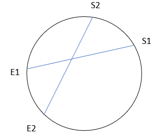

# Structify_Take_Home_Interview_Solution
In My Chord_intersect.py file I have proposed an O(nlogn) appraoch to solve the Chord_intersection problem. 
There are many thoughts and approaches that I tried and implement and finally coded the most optimal approach. I would also like to disscus all my approaches.

Optimal Appraoch (Coded Solution):
* The solution is built on the basic idea that if a chord starts after the start of an other chord but before it ends, and ends after the first chord ends then these chords definately intersect.
* 
* From the Image we can see the labelled vertices and their ordering so if any chords follow similar pattern they definately intersect.
* To implement this we need to basically sort the input based on radian values.
* This logic always works because radian value of e1 is always greater than s1 and same w.r.t to s2 and e2 since its a circle.
* The code implemenatation can be seen in the Chord_intersect.py file.
* The Core Time complexity is turnned out to be O(2n+nlogn) which ulitmates to O(nlogn). Its nlogn because of the sorting operation. .sort() in python uses Quick sort algorithm whose complixity is nlogn.

Another Approach (Solving Through Co-ordinate points):
* In this Approach I though of Finding the co ordinate points of each given radian values( s1,e1,s2,e2).
* This could be done by finding slope with formula of Slope m=tan(theta) and then using y=mx+c and substituting the x and y in circle equation X^2 + Y^2=1.
* Now once we find the all the cordatinate points we can now find the line equations of the chord and iterate one chord with all other chords to solve the line equations and find if there is any common point of x and y.
* This approach results in a O(n^2) time complexity. Hence a better approach is indentified and coded.

Thank you

Jaswanth Kranthi Boppana

jboppana@iu.edu

